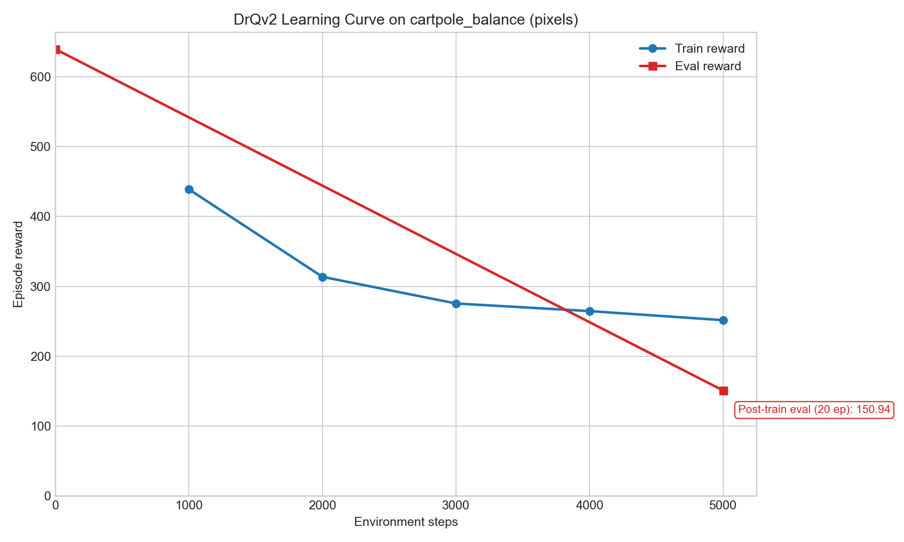

<h1 align="center">RLLTE: Long-Term Evolution Project of Reinforcement Learning</h1>

<p align="center">
  Deep reinforcement learning experiment using <code>rllte-core</code> and <code>dm-control</code>
</p>

## Prepared By

Hussien Ahmed Hussien Hussien 
Al-Abdi Mustafa Majid Mahoud
Tariq Mahmoud Hajji Al-Zaidi

## Project Overview

This repository contains a minimal reinforcement learning project built with `RLLTE`. The current experiment trains a `DrQv2` agent on the DeepMind Control Suite task `cartpole_balance` using pixel observations, evaluates the saved checkpoint, and generates a learning-curve figure from the run logs.

The repository is structured as a small, reproducible experiment:

- `train_rllte.py` trains the agent.
- `evaluate_rllte.py` evaluates a saved checkpoint against the environment and a random baseline.
- `plot_learning_curve.py` converts log files into a graph image.
- `logs/` stores checkpoints, replay storage, training logs, evaluation logs, and generated results.

## Experiment Setup

- Framework: `rllte-core==1.0.1`
- Environment: `dm-control`
- Task: `cartpole_balance`
- Observation type: pixels
- Agent: `DrQv2`
- Device: CPU
- Python version used: `3.12`

## Installation

Install the dependencies with:

```bash
pip install -r requirements.txt
pip install matplotlib
```

## Training

Run the training script:

```bash
python train_rllte.py
```

This creates a run directory under:

```text
logs/drqv2_dmc_pixel/<timestamp>/
```

Typical outputs:

- `train.log`
- `eval.log`
- `model/agent_5000.pth`
- `storage/*.npz`

## Evaluation

Evaluate the saved checkpoint with:

```bash
python evaluate_rllte.py --model-path "logs\drqv2_dmc_pixel\2026-06-19-11-05-55\model\agent_5000.pth" --episodes 20
```

To save the evaluation result as JSON:

```bash
python evaluate_rllte.py --model-path "logs\drqv2_dmc_pixel\2026-06-19-11-05-55\model\agent_5000.pth" --episodes 20 --output-json "logs\drqv2_dmc_pixel\2026-06-19-11-05-55\evaluation_20ep.json"
```

## Plotting the Learning Curve

Generate the graph with:

```bash
python plot_learning_curve.py --log-dir "logs\drqv2_dmc_pixel\2026-06-19-11-05-55" --eval-json "logs\drqv2_dmc_pixel\2026-06-19-11-05-55\evaluation_20ep.json" --output "logs\drqv2_dmc_pixel\2026-06-19-11-05-55\learning_curve.png"
```

## Current Result

Run used in this repository:

- Checkpoint: `logs/drqv2_dmc_pixel/2026-06-19-11-05-55/model/agent_5000.pth`
- Post-training evaluation episodes: `20`
- Trained policy mean reward: `150.94`
- Random baseline mean reward: `341.20`

This result shows that the current `5000`-step training run is still an early-stage experiment. The trained policy underperforms the random baseline, so the model is not yet solving the task reliably.

## Learning Curve



## Notes

- `train.log` contains online training rewards, not a final deterministic benchmark.
- The checkpoint is loaded with `weights_only=False` because newer PyTorch versions changed the default checkpoint-loading behavior.
- The current scripts are intentionally small and are suitable for extension with longer training, more frequent evaluation, and best-checkpoint saving.

## Project Structure

```text
.
|-- README.md
|-- requirements.txt
|-- train_rllte.py
|-- evaluate_rllte.py
|-- plot_learning_curve.py
`-- logs/
```
